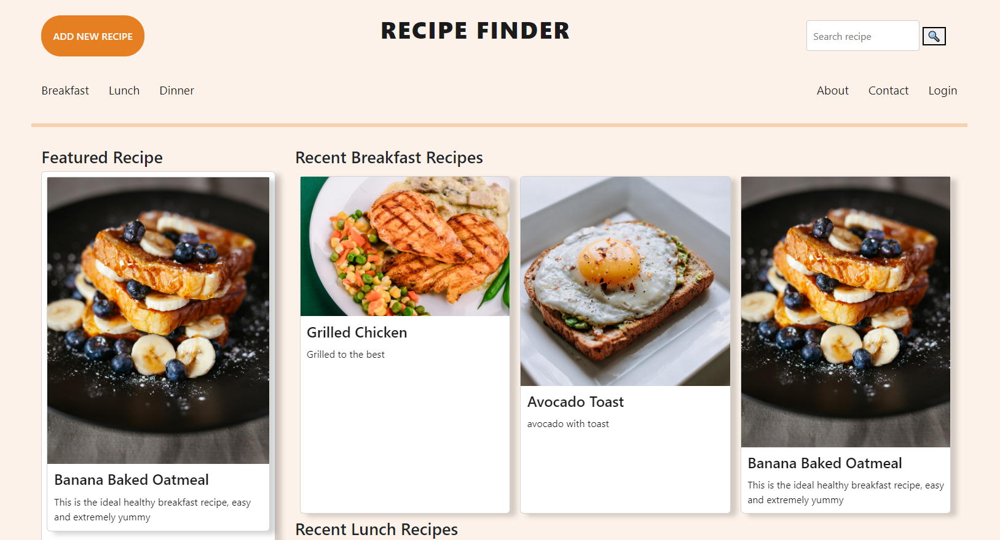
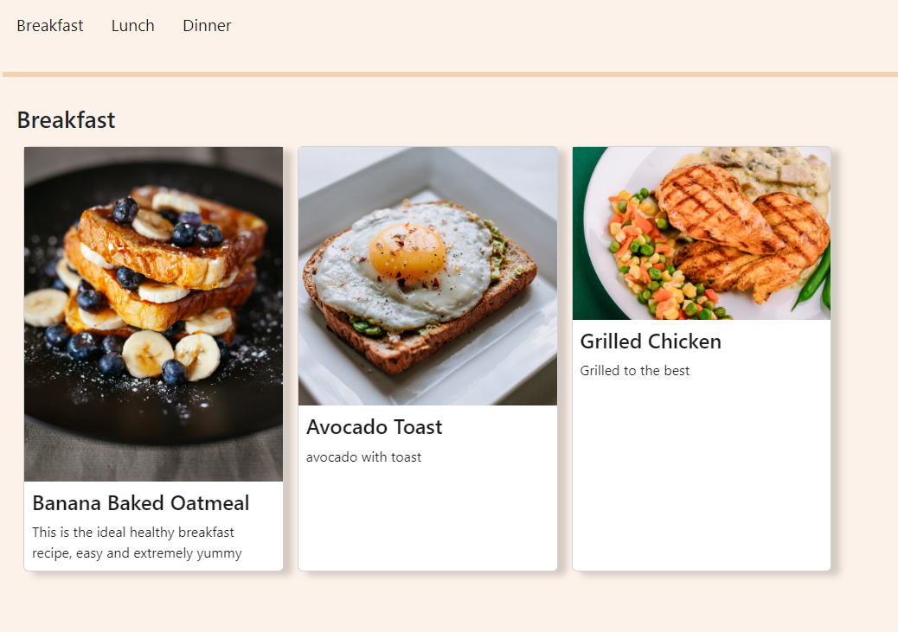
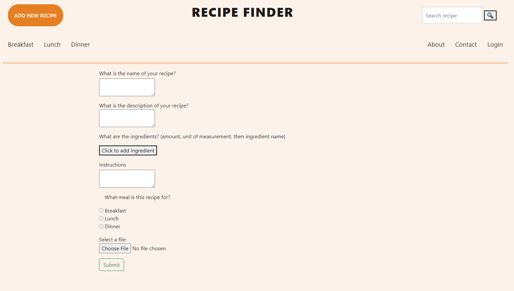

# Your Favorite Recipe Finder

The idea behind this project originated from the desire to create an application that provides a quick and easy way to find yummy recipes. As we live in this tech-centric world; school, work, playing games, and other activities have migrated online due to many factors including COVID19.

## Audience

The target audience is you, the user behind the screen. We believe this website can be a great resource for all individuals, especially those who enjoy cooking. With COVID-19 still ongoing, why not make staying at home more enjoyable by preparing some delicious recipes?

## Functionality

We created a recipe finder application that contains a collection of recipes for the categories of breakfast, lunch, and dinner. The user can additionally choose to add their own recipe to the website. The user can do so by clicking the ADD NEW RECIPE button. The user will be directed to a form where the user can enter the recipe's information, including name, description, instructions, ingredients, and a corresponding image.

## Technologies

The technologies used to crateSd this project include Handlebars, CSS (Bootstrap and GoogleFonts), JavaScript, Node.js, Express, mySQL, Sequelize, ingredient parser (npm package), and LucidChart for creating our diagram and front-end design during planning phase.

## Roadmap

In the future, we would love to implement an authentication feature so the users can sign up, login, and log out as needed. In the user's account, they will be able to edit and delete their recipes as pleased, as well as adding their favorite recipes to a Favorite-List. The user will also be able to add reviews on recipes for a more engaging user experience. Lastly, we plan on implementing the search bar so the user can look for their favorite recipe and be directed to the recipe of choice in the page.

## Contribution Guidelines

Only authorized contributors may add to this repository.

## Links

Deployed app: https://salty-island-34746.herokuapp.com/

